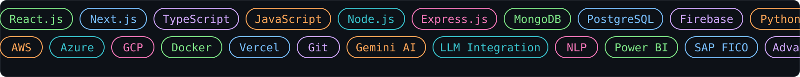

<h3><code>farhan@github ~ $ ./contributions.sh</code></h3>

  

<h3><code>farhan@github ~ $ whoami</code></h3>
<table>
  <tr>
    <td valign="top"></td>
    <td valign="top"></td>
  </tr>
</table>

  

<h3><code>farhan@github ~ $ ls ./skills --sort=stars</code></h3>

  

<h3><code>farhan@github ~ $ cat ~/certifications.log</code></h3>

  

<h3><code>farhan@github ~ $ cat contact.txt</code></h3>

## 🤝 Contributing

Improvements are welcome!

1. Fork the repo and create your branch (`git checkout -b my-fix`)
2. Commit your changes
3. Open a pull request describing what you changed
